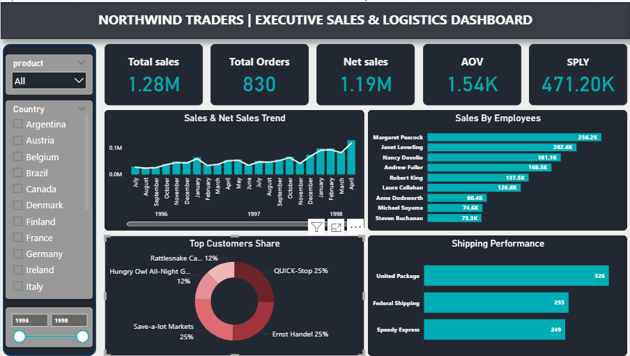

# 📊 Northwind Traders - Executive Sales & Logistics Dashboard

An executive-level Power BI dashboard built on the classic **Northwind Traders** dataset. Designed with a custom high-contrast dark theme UI/UX, accurate data modeling, and structured 2x2 grid visualizations to drive actionable business insights.

---

## 🎨 Visual & Theme Specs
* **Background:** Dark Mode (`#222831`)
* **Accent / Bars:** Turquoise (`#00ADB5`)
* **Borders & Cards:** Slate (`#393E46`)
* **Text / Highlights:** Off-White (`#EEEEEE`)

---

## 🔑 Key Features & Insights
* **KPI Header Cards:** Real-time visibility into `Total Sales`, `Total Orders`, `Net Sales`, `AOV` (Average Order Value), and `SPLY` (Same Period Last Year).
* **Sales & Net Sales Trend:** Line & Clustered Column Chart tracking monthly performance and net revenue trajectory.
* **Sales by Employee:** Horizontal Bar Chart identifying top-performing sales representatives.
* **Top Customers Share:** Donut Chart displaying market contribution and revenue concentration among key clients.
* **Shipping Performance:** Logistics distribution analyzing order volume across shipping providers.

---

## 🛠️ Data Model & Tech Stack
* **Tool:** Power BI Desktop
* **Data Entities:** `Orders`, `Order Details`, `Customers`, `Employees`, `Shippers`, `Products`, `Calendar`
* **DAX Measures:** Custom measures for `Net Sales`, `AOV`, `SPLY`, and order counts.
